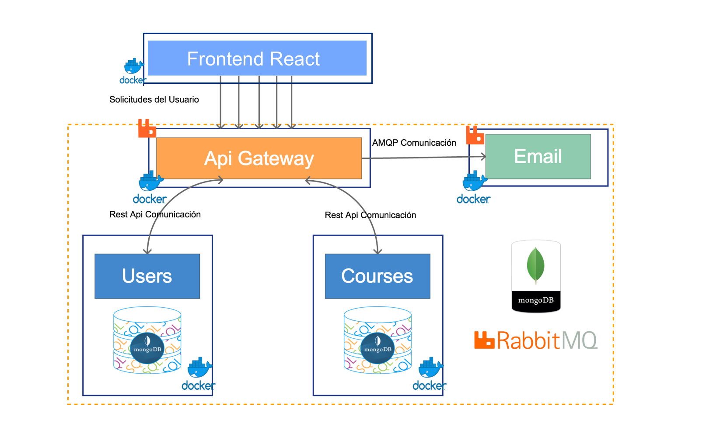
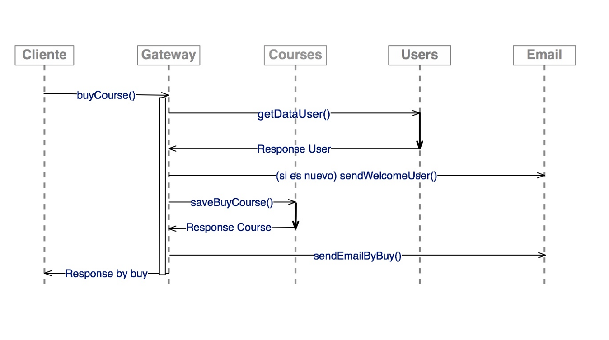

# Microservicios 

Este es un pequeño ejemplo de microservicios en NodeJS con 
base de datos MONGODB, 

Estos microservicios se comunican entre ellos via Rest Api
y por el protocolo AMQP con ayuda de RabbitMQ 

## Configuración

En la carpeta email-service/src/config contiene el archivo config.ts , ahi esta la configuración para el envio de Correos, configurela con su cuenta Gmail.

```
email:{
        'service':'Gmail',
        'userEmail':'xxxxxxx@gmail.com',
        'userPass':'xxxxxxx',
        host:'localhost',
    },
```

## Instalación

```
$ docker-compose up -d
```

Este proceso tardara un poco, por que bajara las imagenes que talvez no las tenga e instalará las dependencias de cada microservicio.

Una vez terminado el proceso, ingrese en su navegador a [http://localhost:3000](http://localhost:3000) y vera una lista de Apis con los que se comunica con el cliente.

### Nota

Si quiere modificar algun microservicio para poder reflejar los cambios ingrese 

```
$ docker-compose build <nombre del servicio>

// ejemplo
$ docker-compose build email
```
Luego de esperar su ejecución levante el servicio 

```
$ docker-compose up <nombre del servicio>

// ejemplo
$ docker-compose up email 
```

# Microservicios Ejemplo de Flujo

En el anterior post (Microservicios Conceptos) hablamos un poco de que son los microservicios , también de la reglas que se debe de cumplir para realizar un microservicio. En este Post desarrollaremos un pequeño ejemplo que sera una pequeña aplicación para poder ver información de cursos o libros.
## Ejemplo
Se realizará una Tienda de Libros o Cursos donde se mostraran los artículos disponibles, el cliente podrá obtener información de cualquier artículo ingresando su email. Un cliente podrá ver los artículos que obtuvo solo proporcionando su correo.
### Diagrama
Para este pequeño ejemplo utilizaremos cuatro microservicios :
* Api Gateway.- Tiene la tarea de comunicarse con el frontend y según las peticiones de el usuario se comunica con los otros microservicios.
* Users y Courses.- Dos microservicios que estan en un nivel atómico estos solo se encargan de ellos. Notemos que cada microservicio tienes su propia base de datos.
* Email.- Microservicio encargado solo de enviar correos a los usuarios, notemos que no tiene una comunicación REST API como en los anteriores microservicios, para este utilizaremos el protocolo AMQP ayudandonos con RabbitMQ, esto nos dará la capacidad de poner en cola las peticiones que le estén llegando.


### Flujo
Se mostrará una variedad de libros o cursos de los cuales el usuario podrá seleccionar alguno, si desea obtener información de algún articulo entonces procedemos a pedirle su Correo para mandarle la información del artículo que selecciono ,si el Usuario es nuevo entonces se le enviara un correo de bienvenida a la aplicación, posteriormente se le enviaremos la información del artículo que selecciono.



#### Descripción
*BuyCourse: Desde el cliente se hace la solicitud de información de un artículo a el servicio Gateway.
* GetDataUser: El servicios Gateway solicita los datos del Usuario al servicio Users enviando el email del cliente ,este servicio verifica si el usuario existe ,si no existe el usuario crea uno nuevo con el email proporcionado , teniendo el usuario respondemos a el servicio Gateway enviando el usuario.
* SendWelcomeUser: El servicio Gateway verifica si el usuario obtenido a sido creado recientemente si es así se envía un correo de Bienvenida a la Tienda.
* SaveBuyCourse: El servicio Gateway se comunica con el servicio Courses ,este guarda los datos de la solicitud de información de el articulo por usuario, al finalizar el guardado del curso se manda una respuesta de exitosa a Gateway.
* SendEmailByBuy: Una vez realizada la solicitud se realiza el envio de un email al cliente con la información de el artículo.

Este solo es un flujo de una funcionalidad que se puede realizar con la aplicación. Seguramente pensaron pero si esta aplicación se podría hacer de una forma mas sencilla con una arquitectura monolítica y yo les diría “ Pues si ustedes tienen razón” pero recordemos que este es un ejemplo, generalmente la arquitectura de microservicios se aplica para aplicaciones de gran crecimiento esto nos ayudara a modularizar cada funcionalidad que necesitemos ,y cada modulo sera independiente a cualquier otro modulo.

### Desarrollo
Para realizar este objetivo utilizaremos las tecnologias :

* Docker
* Nodejs
* MongoDB
* RabbitMQ

Y para la realización del frontend:
* React
La lista de End Points del servidor node están http://localhost:3000